# CS205·C/C++ Programming Report

## Project4 Report:  A 2D GPU Mat

### 赖海斌

### 12211612

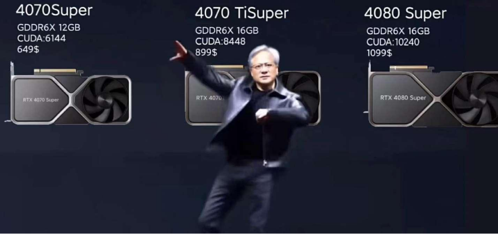

[ 【NVIDIA 黄仁勋 跳科目三】 https://www.bilibili.com/video/BV1Ye411e7y1/?share_source=copy_web&vd_source=72eac555730ba7e7a64f9fa1d7f2b2d4]

### 摘要

本次项目的重点在于开发了一个功能强大的GPU矩阵类，该类实现了多数据输入、运算符重载、感兴趣区域（ROI）操作、内存管理以及跨GPU运算等关键功能。在此过程中，我们深入研究了GPU内存与通信设计概念，并获得了对GPU CUDA编程的实践经验。这一项目不仅使我们对C/C++的特性有了更深入的了解，而且为我们进一步探索并发编程和GPU加速计算提供了坚实的基础。

**关键词：cvMat；CUDA；System Design；GpuMat；memory-safe；**

*目录 Content*

    Part 0: 对前3次Project的总结与对后2次Project的展望

    Part 1: 需求分析

    Part 2: 我们怎么开始：参(fu)考(zhi)

    Part 3: 实现过程 & 难点分析

        1.构造器&析构函数

        2.如何正确地拷贝矩阵

        3.数据upload & download

        4.在多张GPU上分配矩阵

        5.类型转换&计算

        6.ROI

    Part 4: 简单测试

        1.可用性测试

        2.速度测试

    Part 5: 总结

    Reference

# Part 0:对前3次Project的总结与对后2次Project的展望

什么是于++？这个问题困扰了很多计系学生。一个简单的“Yu”字，意味着给分不确定，不理解，高难度。这门课令许多人谈虎色变，以至于我上学期末跟李卓钊老师谈起，这学期我想选C/C++时，导师大惊：“万分小心！听说那门课工作量很多！”。然而，我是一个喜欢Project的人，我也不喜欢听别人说啥就是啥，5个Project驱使着我加入到了这学期的100个倒霉蛋里。但是在三次Project结束后，突然有一天我在想，这5个Project到底意味着什么？我为什么要做这5个Project？

Project1是从计算器这类基础运算开始的。在以往的Java,Python里，我们大多时候不是很关注数据类型，比如float和double，亦或者这些语言都有很好的数据类封装及api。在实现Project1的时候，指针、栈、正则表达式开始引起我们注意。Project1是想告诉我们，C/C++关注于底层，它是比Java颗粒度更小、更精细化的语言。在这门语言上设计一个小系统，才能体验到精细化的感觉。

Project2是Java和C的比较。我们在过去的优化里大多只是关注算法层面的优化，比如剪枝、更好地局部搜索。但是，我们的代码是如何执行的，C为什么快于Java，似乎研究的同学更少。Project2是想告诉我们，C/C++的精细化与对底层的接近，使得它的程序性能更高，有更多的优化方向。同时，计算机软硬件构成的复杂系统让C/C++执行情况更复杂，执行时不能一概而论。

Project3是优化浮点数矩阵乘法。在了解到C/C++的高性能后，我们开始实践技术。我们复习并运用了SIMD，OpenMP。但是我们惊讶的发现，OpenBLAS是个强劲的对手。突然，我们的toy程序被一个精密优化的复杂系统所折服。Project3是想告诉我们，作为一门精细的语言，无数程序员用C/C++对程序做了系统性的优化，我们在学习优化同时，也要明白这门语言所创造的系统工程。

Project4是矩阵类的设计。在这里，我们会参考cv::Mat,学习构建一个大型工程内的一个类。跟之前的底层和优化相比，这回特性和系统占据了主导。封装管理、内存泄露、软copy、运算符重载开始运用。Project4可能是想告诉我们，如何开发一个系统，如何用C/C++搭建系统，如何管理好系统。

Project5往年Project是神经网络，这两年CUDA与GPU的活跃，让我们看到C/C++在这方面的大放异彩，我也准备在这里看看GPU的应用。C/C++是一门古老、但至今仍活跃在种工业界的语言。

C/C++的Project是变化的，每年计算器、矩阵、神经网络都会轮着来。但是其核心，想必我们从上面的描述中已经发现了，“优化——系统——应用”是我们学习这门底层语言的流程。这是它的特性决定的。因此，单纯地掌握C/C++语法，其实根本没有入门。这就像二战时期日本的“知美派”，知道美国有几艘航空母舰、多少飞机并不能打败美国；了解美国人的出击战术、航母部署方式、思考方式，才能真正击败对手（说的就是你，山本五十六）。

# Part 1:需求分析

我们需要一个什么样的Matrix类？我的第一个想法是，复刻一个跟OpenCV一样的就好了。我甚至已经想到，一个good example里一定有个哥们实现了这个。但是OpenCV为什么要这么设计？更多的时候是为了满足图像处理的需要。但是我想做出一个更普通的GpuMat，它可能没有channel，但是可以当作一个还算不错的矩阵类。我因此便提出了我对这个类的期望：

## 1. 安全需求

可以安全申请内存，释放内存
数据不会二次释放

## 2. 计算性能需求

数据复制到GPU的速度尽可能快
启动最佳的线程数进行计算
更多有趣的运算

## 3. 可用性需求

更多的适合的数据类型，如FP16
可以使用多个GPU同时计算
Python支持（有点大）
ROI设计

# Part 2:我们怎么开始：参(fu)考(zhi)

虽然以前写过一些简单的CUDA样板函数，但是写一个跟GPU深度结合的类我还是第一次。我首先参考cv::GpuMat。这个类没有cv::Mat那么庞大，拥有跟Mat类似的功能和api，同时它也是个二维矩阵，非常适合学习及改进。

我将它的成员都丢了下来，随后开始分析，把它内部的设计总结为重要的6个部分：构造/析构函数，类型转换/运算符重载，copy问题，运算api，基本方法，ROI。在我的实现中，我也是按照这几个部分进行一一设计。

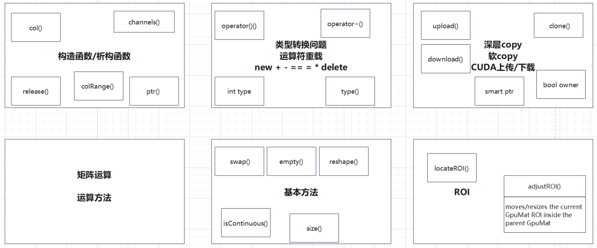

另外，从Project3对GPU硬件的了解中我们很容易明白，CUDA != C/C++，有这么几个性质我们必须注意：

1. 核函数谨慎使用模版！在CUDA分配内存时在计算上，CUDA对于不同的数据类型调用的计算核是不一样的，面对不同数据类型矩阵的计算需要我们提前转换。

2. 谨慎处理__global__函数。__global__函数传参是通过常量内存传入GPU的，且规定参数大小不得大于4KB。**global__函数不支持可变长参数。另外，开发者不能将一个操作符函数（如operator+、operator-）声明为__global**，__global__函数不支持递归，不支持作为类的静态成员函数，支持类的友元声明但不支持在友元声明同时进行定义。

3. CUDA尚不支持类的static静态数据成员。

4. nvcc 版本 11.0 及更高版本支持所有 C++17 语言功能，但受此处[ https://docs.nvidia.com/cuda/cuda-c-programming-guide/index.html#cpp17]描述的限制的约束。

5. 没有smart pointer的支持[ https://forums.developer.nvidia.com/t/smart-pointers-in-device-and-global-functions/159561 不过，比较好的是有人做了一个cuda的share pointer。但它的大小看着很吓人https://github.com/roostaiyan/CudaSharedPtr/blob/main/cudasharedptr.h]，需要自己包装实现。

# Part 3:实现过程 & 难点分析

我在Github上简单做了一个网页文档：<https://laihb1106205841.github.io/GpuMat.github.io/annotated.html> 在这里我也会上传源代码：Laihb1106205841/GpuMat.github.io: A matrix class for GPU on SUSTech 2024Spring C/C++ Project4

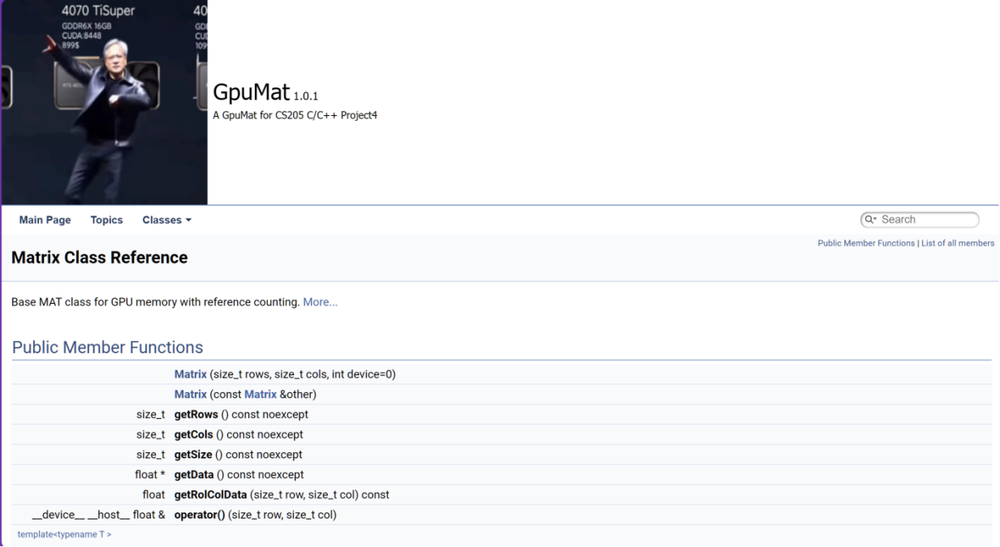

## 1. 构造器 & 析构函数

使用了 CUDA 的统一内存（Unified Memory）来分配内存，这样可以使内存在 CPU 和 GPU 之间自动进行数据迁移，从而简化了内存管理。
构造函数不会初始化矩阵的数据值，而是在需要时由用户自行设置。
支持多数据类型。Parent_matrix为ROI的设计。

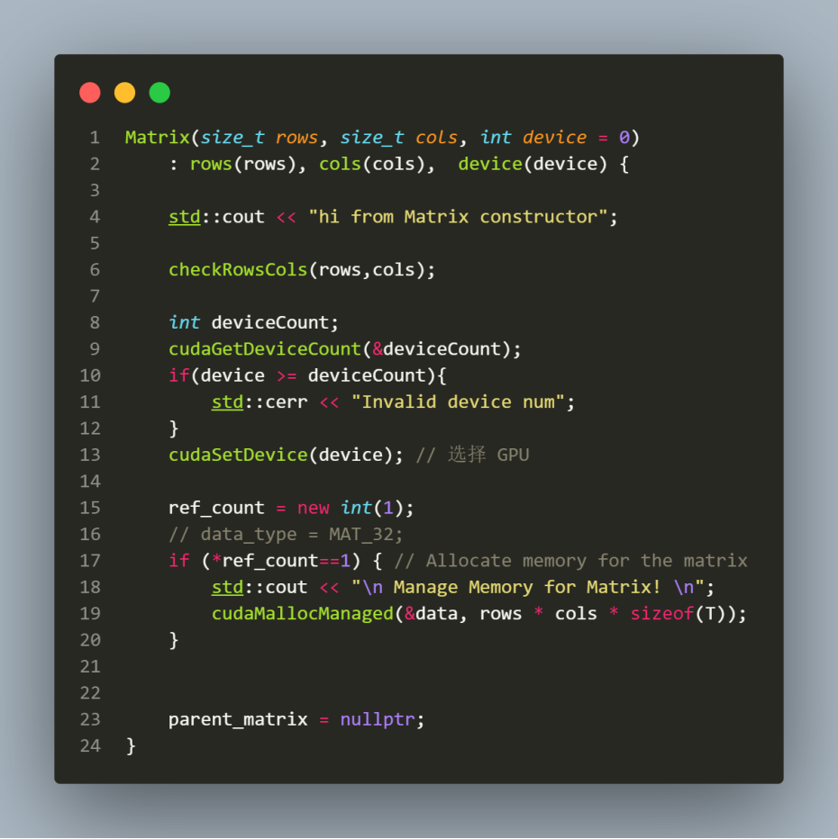

大致设计见下图：

## 2. 如何正确地拷贝矩阵

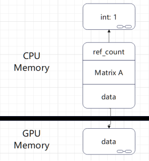

### 2.1 浅拷贝

矩阵在拷贝的时候，我们设想的浅拷贝应该是只拿取原矩阵的大小、数值指针，对数据层面不会进行复制或重写等操作。为解决这一问题，我们引入了ref_count计数器，针对同一块矩阵对其使用次数进行计数。在初始化阶段，Matrix在GPU上分配一段内存给矩阵使用，CPU上记录当前矩阵的信息及引用次数。

随着新矩阵在“=”运算符后赋值、浅拷贝方法中创建，ref_count会自增加1。而每次析构矩阵时，ref_count会减1。当ref_count在最后一个引用的Matrix也将被释放时，我们再释放GPU上的data。这里ref_count使用int是防止我们在设计时不小心多减成了负数，这样会非常难处理。

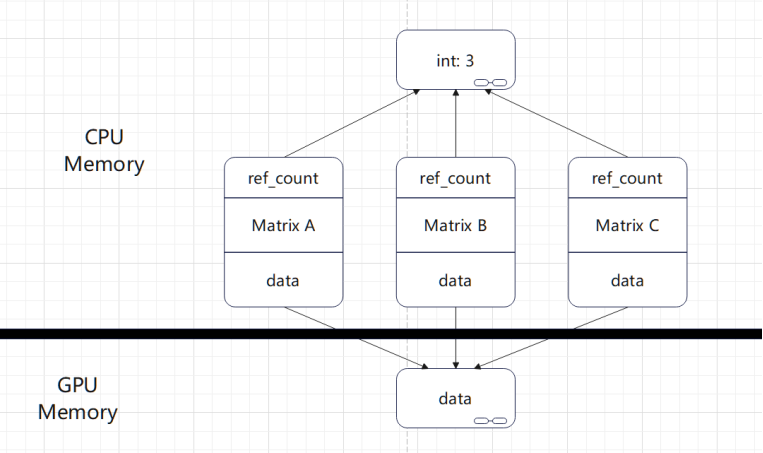

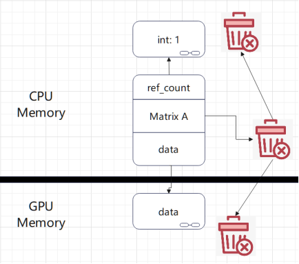

不过我的最初版本跟这个count的版本不同。我最初是想使用一个bool owner来管理data。每当我创建一个新的浅拷贝时，新的矩阵owner = true，旧的为false。也就是把data交给最后一位拷贝的矩阵处理。但是这里面存在的问题是，假如我们中途不小心删除了最后一位，那么我们将永远无法释放GPU上的数据了。因此，我后面改用了count这一更安全的设计。这也是share_pointer与opencv里的想法。

要注意的是，GPU上的数据须使用cudaFree()函数将数据释放而不是delete[]。面对空指针，cuda文档里提到，“cudaFree If devPtr is 0, no operation is performed” ，这和free函数的效果是一样的。
但是神奇的是，我们可以多次声明cudaFree()函数而不引起程序崩溃，这可能是因为虽然在GPU上我们确实是二次释放了内存，但是我们在CPU上对错误异常没有进行处理。

如果想处理这一异常，我们需要检查它返回的cudaSuccess。

另外查看文档发现，cudaMalloc使用的是指向指针的指针，CUDA设计者选择使用返回值来携带错误状态[ 更多的讨论：https://stackoverflow.org.cn/questions/12936986]。这和我们之前用的malloc函数返回一个新的指针不同。我们也会在接下来的多GPU环节结合文章[ 内存分配不再神秘：深入剖析malloc函数实现原理与机制 - 知乎 (zhihu.com)] 对malloc的介绍以及Project3学习的知识比较这两个函数。

### 2.2 深拷贝

我们要在CUDA上重新分配一次内存，并把数据重新拷贝过去。直接的设计非常简单，直接调用cudaMalloc和cudaMemcpy就可以了。
但是GPU跟CPU很不一样的是，CPU中我们的地址都已经是逻辑地址，无论我们的机器有多少内存条等物理状况，在BIOS识别到内存后，OS会用MMU给定的虚拟内存代替物理地址。但是CUDA的分配不同，cudaMalloc不允许一个整块的矩阵一半分配在GPU0，一半在GPU1。
为了搞清楚情况，OS，启动！

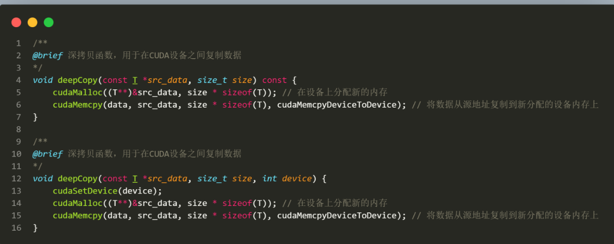

在MMU中，它会完成地址转换的操作。当程序访问内存时，它使用的是逻辑地址，并将逻辑地址转换为物理地址，以便正确地访问内存中的数据和指令。这种地址转换是通过页表或段表等数据结构来实现的。
在虚拟内存管理中，页表（Page Table）是一种数据结构，用于将逻辑地址映射到物理地址。它将系统中的每一页（通常是固定大小的内存块，比如4KB）映射到物理内存中的对应页框（或称为物理页）。每个进程都有自己的页表，用于管理其虚拟地址空间和物理内存的映射关系。

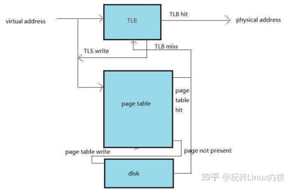

当我们的CPU程序访问内存时，程序提供的是逻辑地址。MMU根据页表将逻辑地址生成PTE地址[ PTE（Page Table Entry）地址是页表中的条目所对应的物理内存地址。]，然后再进行实际的内存访问。这里边会存在两个状态：命中，缺失。

页命中（Page Hit）： 当程序访问的内存页面已经在物理内存中时，称为页命中。这意味着所需的数据或指令已经在物理内存中，程序可以直接访问它，而不需要从磁盘或交换空间中加载。

页缺失（Page Fault）： 当程序访问的内存页面不在物理内存中时，称为页缺失。这意味着所需的数据或指令尚未加载到物理内存中，可能因为被换出到磁盘或是第一次访问。当发生页缺失时，OS会将相应的页面从磁盘或交换空间加载到物理内存中，更新页表。然后，程序被重新启动以继续执行。

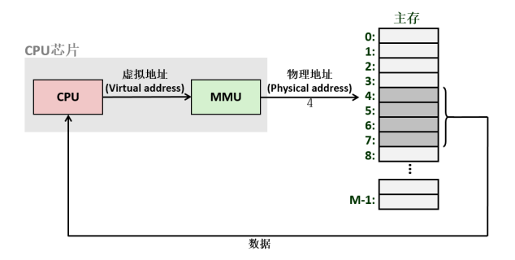

这和我们的计组课上学习的Cache工作原理基本差不多。或者换句话说，其实内存中的思想基本上是一致的。[ 《计算机体系结构：量化研究方法 第6版》内存章节P92页对这部分进行了详细的说明，P105页对Intel Core i7 6700的实现做了介绍]所以我们在这里看到一个很关键的因素，我们之所以可以在CPU上愉快地用逻辑地址，MMU功不可没。

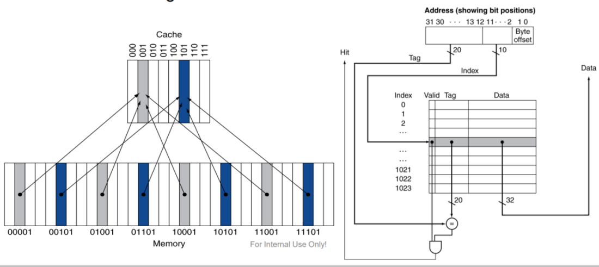

那么，GPU没有连着MMU啊，那可咋整？
一开始我看到确实不行。最早期的cudaMalloc以及cudaHostMalloc分别只分配device（GPU）和Host（CPU）的内存，而想要通信，需要调用cudaMemcpy进行拷贝，并且拷贝时，CPU的指针和GPU的指针是无法共通的，或者说，你的CPU指针不能指向GPU的内存。

此时的cudaMemcpy通过一个指向指向GPU的指针的指针来运作。我们以cudaMemcpy(d_a, &a, size, cudaMemcpyHostToDevice)为例子。a是一个GPU指针，它指向我们的GPU内存。d_a是一个CPU指针，它指向的是a这个指针。但是，我们不能用d_a直接操控GPU，而是要a这个中间商来操控。

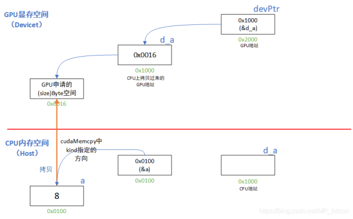

在CUDA 4后，NVIDIA引入了UVA：同一虚拟寻址（不是统一），它把GPU们和CPU连成一块。

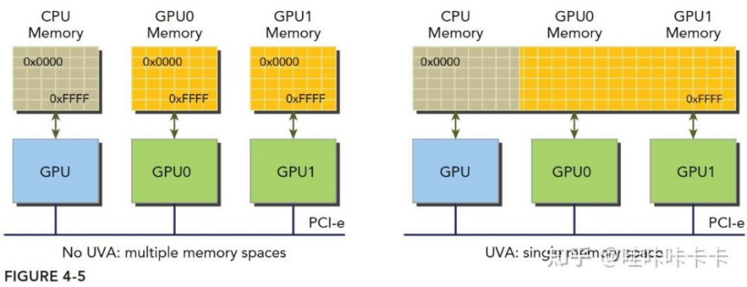

通过UVA，cudaHostAlloc函数分配的固定主机内存具有相同的主机和设备地址，可以直接将返回的地址传递给核函数。
UVA 为系统中的所有内存提供了一个单一的虚拟内存地址空间，无论指针位于系统中的哪个位置，无论是设备内存（在相同或不同的 GPU 上）、主机内存还是片上共享内存，都能从 GPU 代码中访问这些指针。它还允许cudaMemcpy在各个设备上的使用，而无需指定输入和输出参数的确切位置。UVA 支持 "零拷贝"（Zero-Copy）内存，即设备代码可通过 PCIe 直接访问针脚主机内存，而无需使用 memcpy。零拷贝 "提供了统一内存的一些便利，但没有性能，因为它总是通过 PCI-Express 的低带宽和高延迟进行访问。

到了CUDA6.0时代，NVIDIA做出了统一内存寻址（UM）。在UM实现中，他们在CPU和GPU各创建了一个托管内存池，内存池中已分配的空间可以通过相同的指针直接被CPU和GPU访问，底层系统在统一的内存空间中自动的进行设备和主机间的传输。

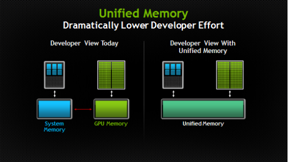

UVA不会像UM那样自动将数据从一个物理位置迁移到另一个物理位置。由于 Unified Memory 能够在主机和设备内存之间的单个页面级别自动迁移数据，数据传输对应用是透明的，大大简化了代码。

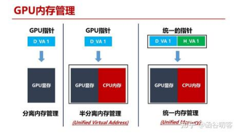 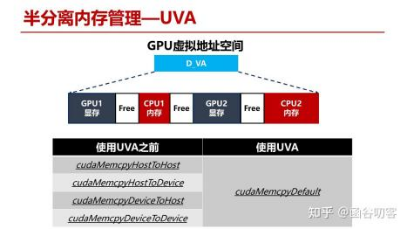 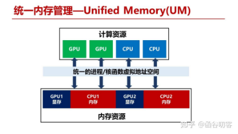

所以，虽然我们的深拷贝函数只有短短几行，但背后是NVIDIA嗯造的屎山 NVIDIA的多代技术累积。我们可以轻松地将自己矩阵声明的指针直接指向GPU内，进而才有我们下面的upload与download函数。

3 数据upload & download
CUDA内的矩阵可以被CPU内的分配，也可以下载到CPU。应用程序可以通过将适当的参数传递给 cuMemAddressReserve 来保留虚拟地址范围。获得的地址范围不会有任何与之关联的设备或主机物理内存。保留的虚拟地址范围可以映射到属于系统中任何设备的内存块，从而为应用程序提供由属于不同设备的内存支持和映射的连续 VA 范围。应用程序应使用 cuMemAddressFree 将虚拟地址范围返回给 CUDA。用户必须确保在调用 cuMemAddressFree 之前未映射整个 VA 范围。这些函数在概念上类似于 mmap/munmap（在 Linux 上）。

## 4 在多张GPU上分配矩阵

好了，刚刚我们了解了CPU与GPU间的内存交互故事。那么，GPU跟GPU间可以相互交互内存吗？
最早期的GPU间通信还是依靠CPU，GPU把数据上传到CPU后，CPU再把数据发送给另一个GPU。
这种方法的效率非常低下。所以很快就被替代掉了。
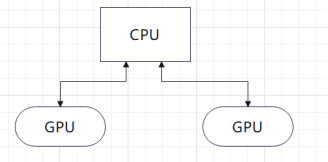
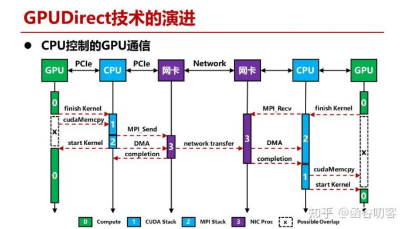

最早绕过CPU执行存储访问的，是一个叫DMA的东西。DMA用于在外设与存储器之间以及存储器与存储器之间提供高速数据传输。可以在无需任何 CPU 操作的情况下通过 DMA 快速移动数据。这样节省的 CPU 资源可供其它操作使用。这个东西被广泛用在CPU能力较弱的单片机上，比如stm32。

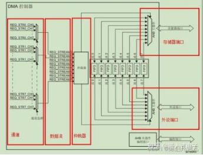
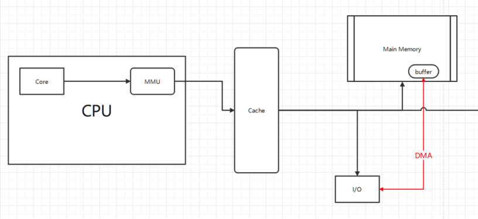

由此，NVIDIA工程师想到了用DMA，将GPU与网卡连接起来。实现GPU-网卡-网卡-GPU通信。就这样，2009年，GPUDirect1.0诞生了。

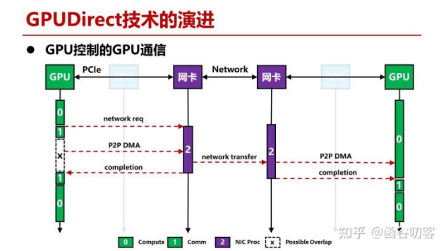 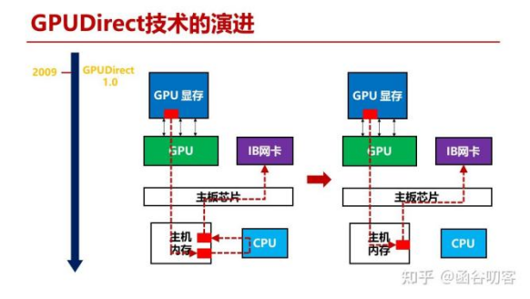

在这一思想驱动下，二代技术很快出现。第二代GPUDirect技术被称作GPUDirect P2P，重点解决的是节点内GPU通信问题。两个GPU可以通过PCIe P2P直接进行数据搬移，避免了主机内存和CPU的参与。

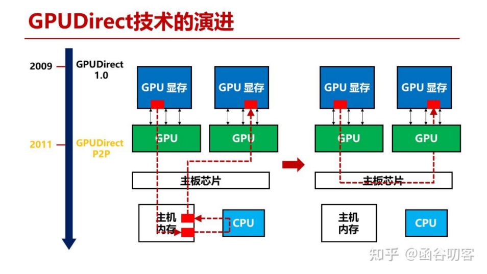

一台机子上不同设备可以访问内存，那，多台机可不可以？这就是RDMA。

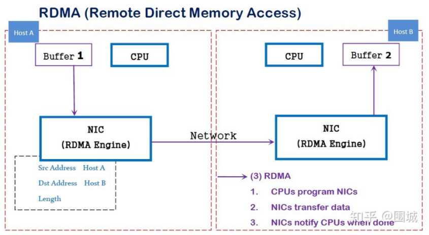

在网络传输中，传统的TCP/IP技术在数据包处理过程中，要经过操作系统及其他软件层，需要占用大量的服务器资源和内存总线带宽，数据在系统内存、处理器缓存和网络控制器缓存之间来回进行复制移动，给服务器的CPU和内存造成了沉重负担。
RDMA是一种新的直接内存访问技术，让计算机可以直接存取其他计算机的内存，而不需要经过处理器的处理，不对操作系统造成任何影响。

在实现上，RDMA实际上是一种网卡与软件架构充分优化的远端内存直接高速访问技术，通过将RDMA协议固化于硬件(即网卡)上，以及支持Zero-copy和Kernel bypass这两种途径来达到其高性能的远程直接数据存取的目标。使用RDMA的优势如下：

零拷贝(Zero-copy) - 应用程序能够直接执行数据传输，在不涉及到网络软件栈的情况下。数据能够被直接发送到缓冲区或者能够直接从缓冲区里接收，而不需要被复制到网络层。

内核旁路(Kernel bypass) - 应用程序可以直接在用户态执行数据传输，不需要在内核态与用户态之间做上下文切换。

不需要CPU干预(No CPU involvement) - 应用程序可以访问远程主机内存而不消耗远程主机中的任何CPU。远程主机内存能够被读取而不需要远程主机上的进程或CPU参与。远程主机的CPU的缓存(cache)不会被访问的内存内容所填充。

消息基于事务(Message based transactions) - 数据被处理为离散消息而不是流，消除了应用程序将流切割为不同消息/事务的需求。

支持分散/聚合条目(Scatter/gather entries support) - RDMA原生态支持分散/聚合。也就是说，读取多个内存缓冲区然后作为一个流发出去或者接收一个流然后写入到多个内存缓冲区里去。
在主流的RDMA技术中，可以划分为两大阵营。一个是IB技术, 另一个是支持RDMA的以太网技术(RoCE和iWARP)。

NVIDIA一看：这东西好啊！于是做出了GPUDirect RDMA。将IB互相连接起来，就实现了GPU间的通信。

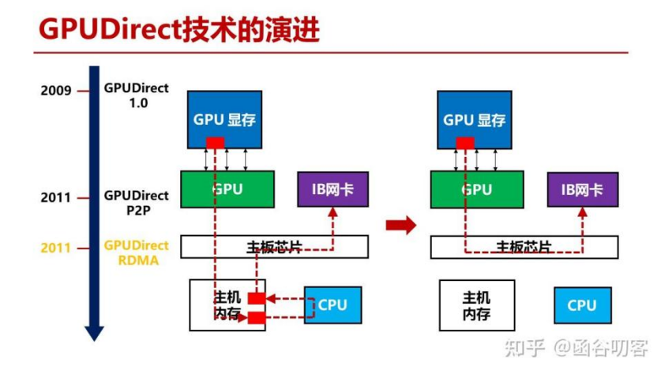

在两个对等体之间设置 GPUDirect RDMA 通信时，从 PCI Express 设备的角度来看，所有物理地址都是相同的。传统上，BAR 窗口等资源使用 CPU 的 MMU 作为内存映射 I/O （MMIO） 地址映射到用户或内核地址空间。但是，由于当前操作系统没有足够的机制在驱动程序之间交换 MMIO 区域，因此 NVIDIA 内核驱动程序会导出函数以执行必要的地址转换和映射。

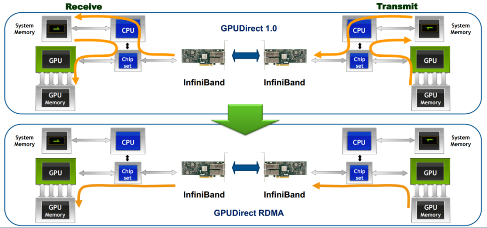

在很多时候，我们的计算需要GPU-GPU的P2P通信，NVIDIA就做出了GPUDirect P2P。GPUDirect P2P通信技术将数据从源 GPU 复制到同一节点中的另一个 GPU，不再需要将数据临时暂存到主机内存中。如果两个 GPU 连接到同一 PCIe 总线，GPUDirect P2P 允许访问其相应的内存，而无需 CPU 参与。

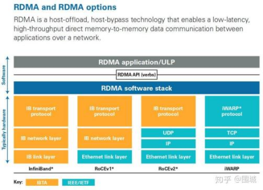

我们实现了基于P2P通信的一个changeGPU函数，它可以将原本放在GPU0的矩阵转移到GPU1去。

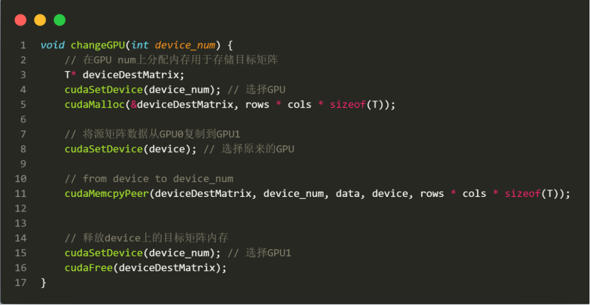

这里边的核心函数就是CudaMemcpyPeer，将GPU device的数据拷贝到GPU device_num上。
由于篇幅限制，对Direct技术的介绍就暂时到这里。

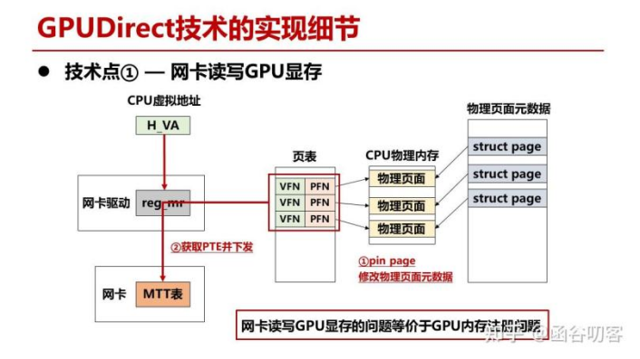 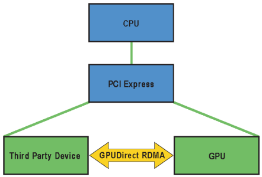

在刚刚的通信中，PCIe3.0*16 的双向带宽不足 32GB/s，当训练数据不断增长时，PCIe 的带宽满足不了需求，会逐渐成为系统瓶颈。为提升多 GPU 之间的通信性能，充分发挥 GPU 的计算性能，NVIDIA 于 2016 年发布了全新架构的 NVLink。NVLink 是一种高速、高带宽的互连技术，用于连接多个 GPU 之间或连接 GPU 与其他设备（如CPU、内存等）之间的通信。NVLink 提供了直接的点对点连接，具有比传统的 PCIe 总线更高的传输速度和更低的延迟。

NVLink 支持多种连接配置，包括 2、4、6 或 8 个通道，可以根据需要进行灵活的配置和扩展。这使得 NVLink 适用于不同规模和需求的系统配置。

但是，只有8个通道还是太少了。NVIDIA在2018年又发布了 NVSwitch，实现了 NVLink 的全连接。NVIDIA NVSwitch 是首款节点交换架构，可支持单个服务器节点中 16 个全互联的 GPU，并可使全部 8 个 GPU 对分别达到 300GB/s 的速度同时进行通信。

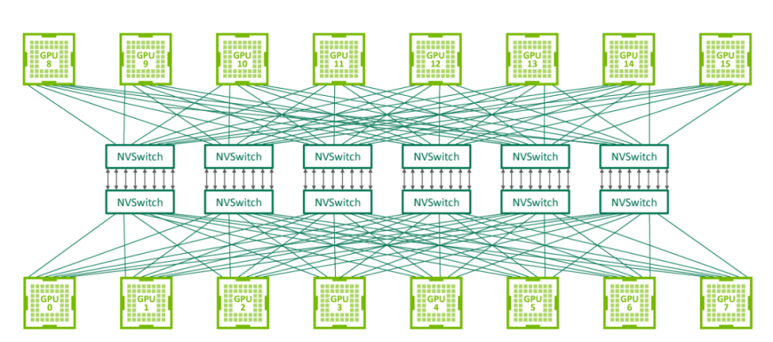

当然，我们这里就用不上了，但是我们可以看到，通信技术的不断增长，背后影射的是计算速度的提升与需求的提高，他们推动着通信的研究。

## 5. 类型转换 & 计算

我们在设计类时为了方便，在CPU上的C++使用了泛型。因此，它只能支持同类型（int + int, float+float）等的转换。不过这问题不大，反正到计算时GPU也只能进行这种操作。

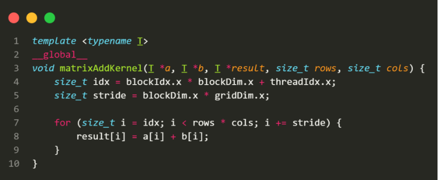
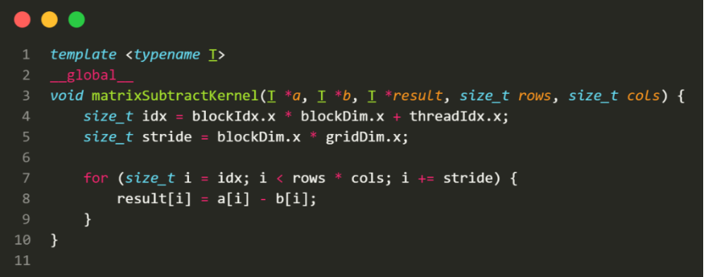
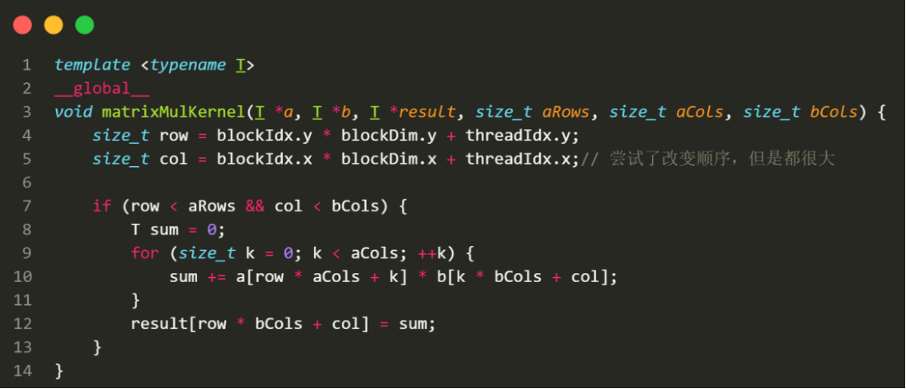

我们这里没有对核函数进行优化，他们将在Project5中使用。这样，Project4的矩阵类也可以作为Project5的模板，非常的方便。

另外提供了一些小函数，比如LU分解。
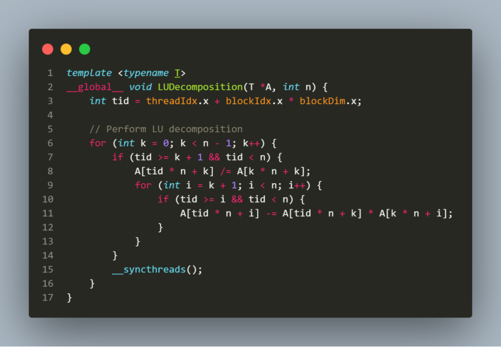

## 6. 重载运算符

重载了+，*，-，=，()等运算符。注意到在加减乘方法中，我们声明了一个新矩阵。

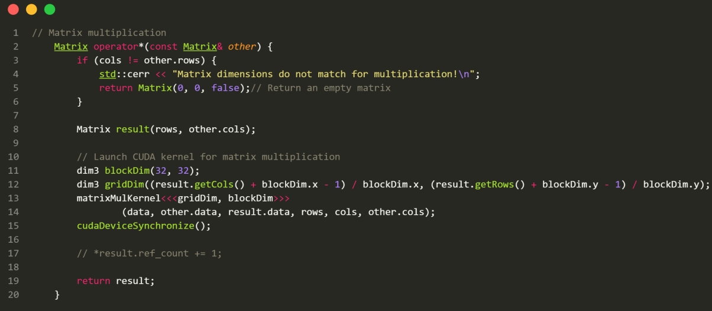

是的没错，如果我们没有之前的软copy的话，我们的矩阵将会把数值重新复制一遍。但是在重写了拷贝构造函数后，我们的矩阵只会复制指针。在result矩阵生命周期停止时，它只会将矩阵的指针传递给我们的结果Matrix，不会对大数据造成影响。

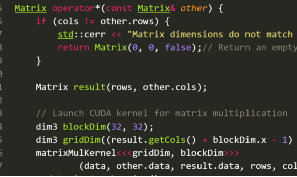 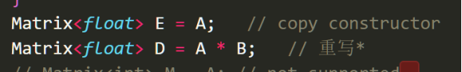
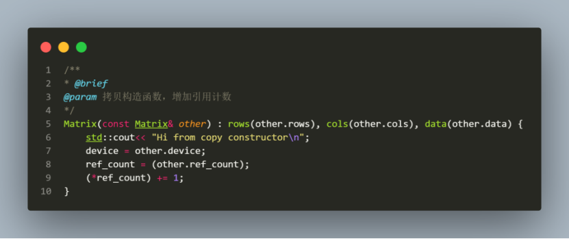

我们的 Matrix 类实现了拷贝构造函数和赋值运算符重载，返回的 result 对象会被正确地拷贝到 C 中，而非直接赋值。

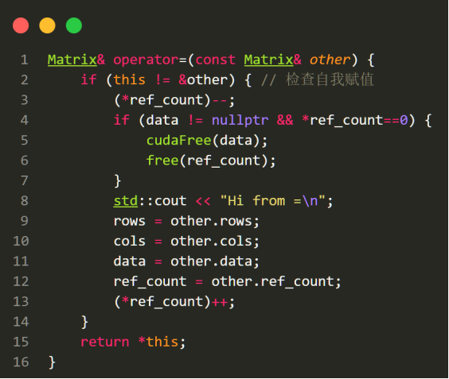

## 6. ROI

回到我们的设计图中，没错，我们将ROI看做是另一个矩阵的子矩阵，或者说我们是对同样一份数据但是指针位置不同的矩阵。他们共享一块ref_count和data，他们的指针指向同一个方向的数据。但是他们的
ROI会遇到一个问题，就是当我们有多个ROI时，我们应该以根矩阵为“参考系”，来计算我们感兴趣的地区。这是董学长在他的报告中指出的：

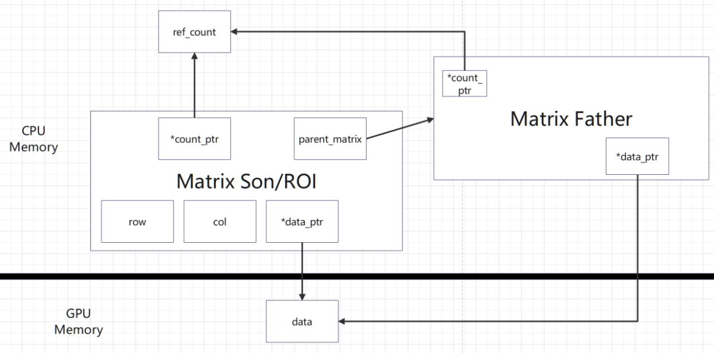

为此我们设计了一个寻找根矩阵的流程。

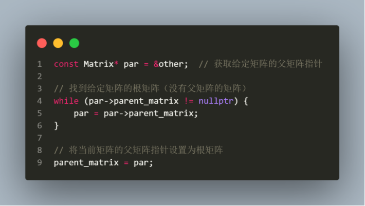

这样，我们的ROI就可以准确定位到我们最想要的矩阵上了。
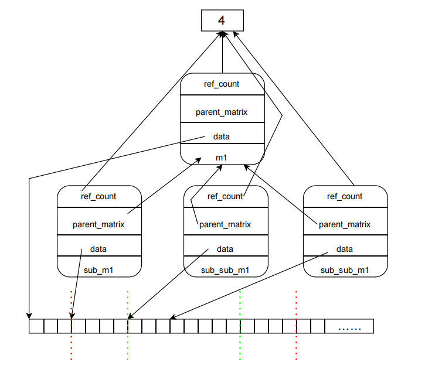
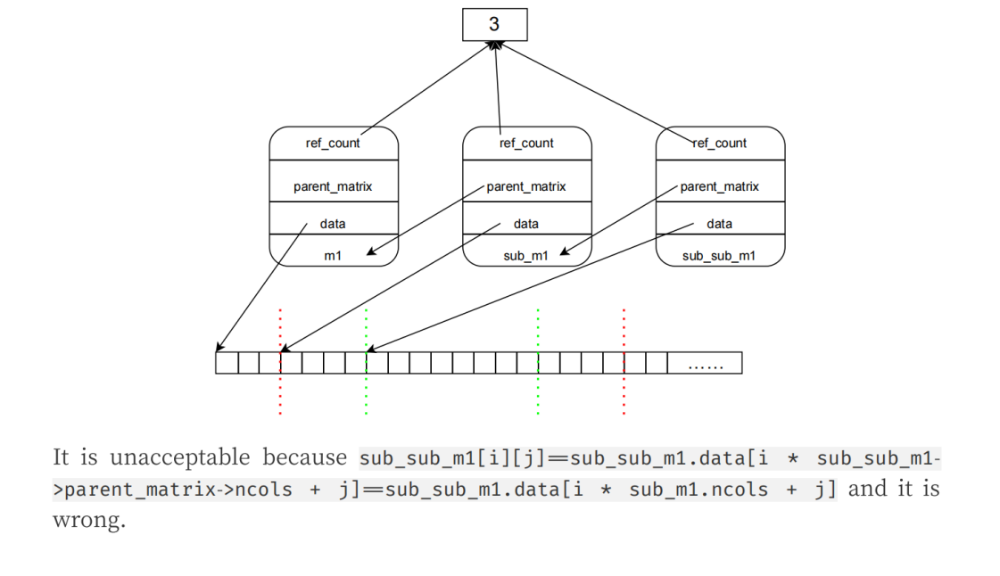

第二个问题产生在释放的时候。如果我们的矩阵是ROI，那么我们如果在释放的时候还是释放的data*，那我们只是释放了ROI的数据，对整个矩阵的数据没有进行释放。
对此，我们可以判断，如果我们的是一个ROI，我们就销毁父矩阵所指的数据区域，也就是全部的数据区域。

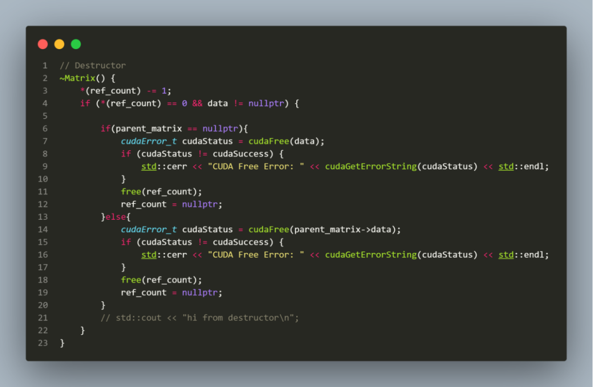

# Part 4:简单测试

我们在Main.cu文件中对矩阵类进行了测试。测试分为可用性测试及速度测试。

## 1.可用性测试

多类型
测试了unsigned char, short, int, float, double, 均可使用。同时，没有出现内存泄露及二次释放。
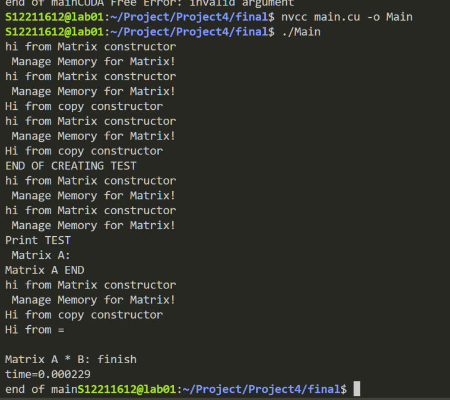

多计算
Float，double，int，unsigned char, short。均可计算。不过不同数据类型的无法进行计算。
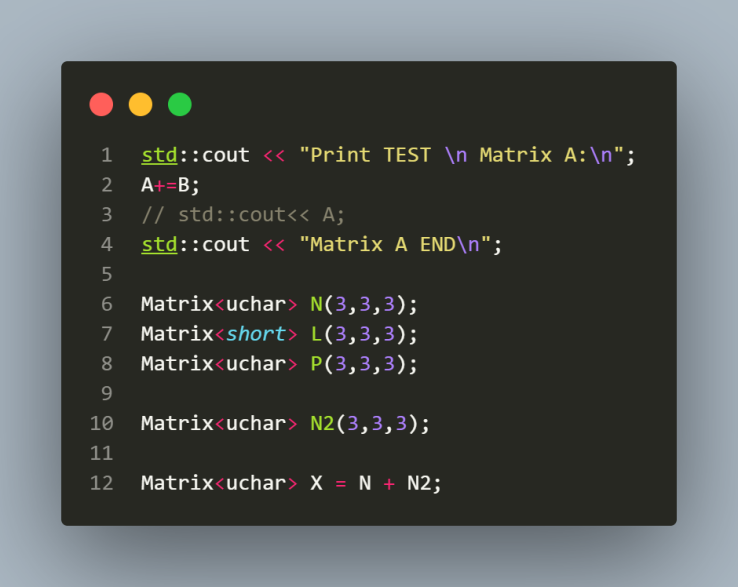

多卡
测试成功，矩阵B移植到了GPU1上，与在GPU0的矩阵A进行运算。有趣的是，A*B的计算是在A上完成的。主要原因是*作为A的运算符重载。
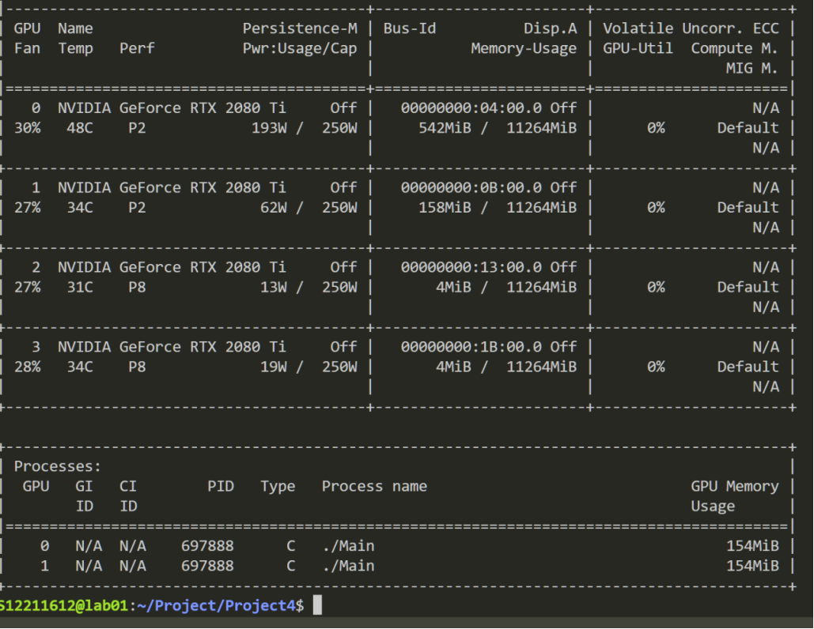

## 2.速度测试

在速度测试中，我尝试复现Project3中周益贤同学所提到的反写线程降速问题。然而，我发现我并没有遇到这个问题，甚至在调换之后，矩阵乘法所用的时间反而增加了。我认为可能的原因是线程数和块的数量分配问题。
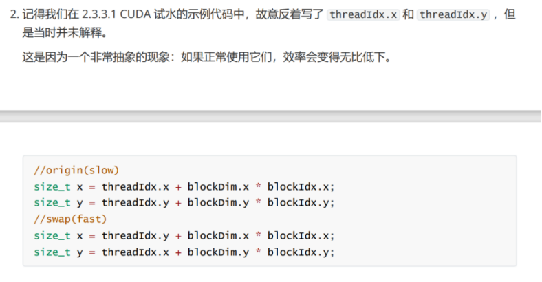

GPU矩阵乘法计算在1000前后都是0.05秒，在升高到8000后来到了0.8s。注意，这里是矩阵B和矩阵A在不同的GPU存储与运算的效果。基本和周同学的测试结果中的plain一致。

# Part 5:总结

在本次Project中我们制作了一个GPU矩阵类，实现了多数据输入，运算符重载，ROI，内存管理，跨GPU运算等操作，有了基本的系统设计概念与GPU CUDA编程的了解，对C/C++的特性了解地更深刻了。

<!-- Reference

[1]United States Department of Transportation. Core System Requirements. Available: https://www.its.dot.gov/index.htm

[2]Specification (SyRS)"IEEE Guide for Information Technology - System Definition - Concept of Operations (ConOps) Document," in IEEE Std 1362-1998 , vol., no., pp.1-24, 22 Dec. 1998, doi: 10.1109/IEEESTD.1998.89424. Available: https://ieeexplore.ieee.org/document/761853

[3]ISO/IEC/ IEEE 42010, Systems and software engineering Architecture description. International Standard

[4]一文彻底理解DMA - 知乎 (zhihu.com)

[5]一文搞懂MMU工作原理 - 知乎 (zhihu.com)

时间比较赶，所以我都在一文搞懂（乐）。

附录：代码
为了防止我在Project上传时cu文件无法上传，我先将代码丢在了这里。当然，也可以去
Laihb1106205841/GpuMat.github.io: A matrix class for GPU on SUSTech 2024Spring C/C++ Project4 我会上传对应的代码。
